# 华为中控屏项目 - 需求文档

**项目名称：** 中央控制屏（Central Control Screen）  
**目标平台：** 华为鸿蒙OS (OpenHarmony)  
**文档日期：** 2025年12月30日  
**版本：** 1.0

---

## 目录

1. [项目概述](#项目概述)
2. [功能需求](#功能需求)
3. [系统架构](#系统架构)
4. [UML用例图](#uml用例图)
5. [模块设计](#模块设计)
6. [关键流程设计](#关键流程设计)
7. [数据模型设计](#数据模型设计)
8. [接口规范](#接口规范)

---

## 项目概述

### 1.1 项目背景

华为中控屏项目是一个为养老、医疗领域设计的智能中央控制平台。通过集成健康监测、智慧医疗、场景控制等功能，为用户提供一站式的健康管理和医疗服务体验。

### 1.2 项目目标

- 提供用户健康体征监测和运动管理
- 提供在线问诊和一键呼叫医疗服务
- 集成智能家居控制功能（能量管理、网络状态、天气预报等）
- 建立模块化的组件体系，便于快速迭代和功能扩展

### 1.3 核心用户

- 老年用户及其家人
- 慢性病患者
- 健康管理爱好者
- 养老机构管理者

### 1.4 主要特点

- **高内聚低耦合：** 采用特性模块化架构
- **跨模块协作：** 通过命名路由实现页面导航
- **实时数据同步：** 支持定时数据刷新和实时传感器数据
- **深浅主题支持：** 适配鸿蒙系统深浅模式

---

## 功能需求

### 2.1 主页功能模块（MainPage）

| 功能 | 描述 | 优先级 |
|-----|------|--------|
| 实时能源监控 | 显示今日电力使用情况和碳排放数据 | P1 |
| 网络状态显示 | 实时显示上传/下载速度和网络质量 | P2 |
| 天气预报 | 显示当前温度、天气状况和天气建议 | P2 |
| 场景切换 | 支持家居、出行、睡眠等多种场景模式 | P2 |
| 通知消息中心 | 汇总健康预警、医疗提醒等信息 | P3 |

### 2.2 健康监测模块（Health）

#### 2.2.1 居家康养（Wellness）

| 功能 | 描述 | 数据来源 |
|-----|------|---------|
| 实时体征监测 | 心率、血压、血氧、体温实时显示 | 穿戴设备/传感器 |
| 健康档案 | 用户基本信息、病史、用药记录 | 本地数据库 |
| 体征数据查询 | 按时间范围查看历史体征数据 | 本地数据库 |
| 健康预警 | 异常数据提醒（如高血压、低血氧） | 实时监测 |
| 宣教资讯 | 健康科普文章和视频推荐 | 内容服务器 |
| 护士服务 | 联系护士咨询和上门服务 | 服务系统 |
| 在线问诊 | 预约和进行医生视频问诊 | 医疗系统 |

#### 2.2.2 运动健康（Sports Health）

| 功能 | 描述 | 数据来源 |
|-----|------|---------|
| 步数追踪 | 记录每日步数和运动距离 | 穿戴设备 |
| 卡路里计算 | 根据步数自动计算消耗热量 | 算法计算 |
| 运动目标管理 | 设置和追踪每日运动目标 | 本地配置 |
| 运动历史 | 查看周/月运动数据统计 | 本地数据库 |
| 运动建议 | 根据数据推荐运动计划 | AI推荐 |

### 2.3 智慧医疗模块（Medical）

#### 2.3.1 一键呼叫（Call Service）

| 功能 | 描述 | 流程 |
|-----|------|------|
| 快速呼叫 | 一键连接医生/护士进行视频通话 | 用户点击 → 匹配医护人员 → 建立连接 |
| 通话计时 | 显示通话时长 | 实时计时 |
| 挂断控制 | 支持用户/医护人员主动挂断 | 点击挂断按钮 → 结束通话 |
| 通话记录 | 保存通话历史信息 | 本地数据库 |

#### 2.3.2 在线问诊（Online Consultation）

| 功能 | 描述 | 流程 |
|-----|------|------|
| 医生列表 | 显示可咨询的医生信息和评分 | 从服务器获取 |
| 问诊预约 | 选择医生和时间进行预约 | 用户预约 → 确认 → 进入排队 |
| 实时沟通 | 支持文本、语音、图片沟通 | WebSocket实时通信 |
| 处方开具 | 医生可以开具电子处方 | 医生开具 → 用户确认 |
| 问诊记录 | 保存问诊内容和医嘱 | 本地+服务器存储 |

---

## 系统架构

### 3.1 整体架构图

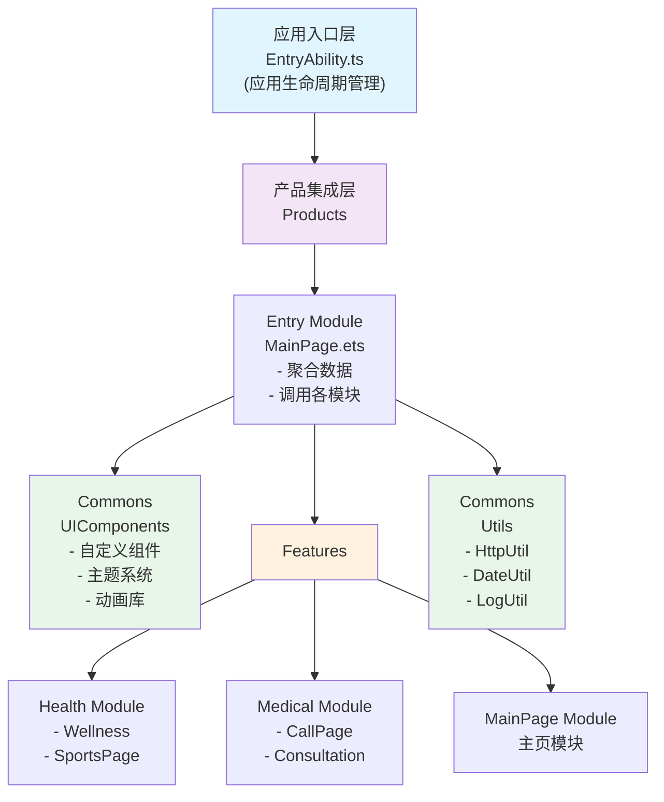

### 3.2 分层说明

| 层级 | 职责 | 示例 |
|-----|------|------|
| **应用入口层** | 应用生命周期、权限管理、全局初始化 | EntryAbility.ts |
| **产品集成层** | 组装各个特性模块、汇总首页数据 | Entry模块、MainPage.ets |
| **特性模块层** | 独立的业务模块，高内聚低耦合 | Health、Medical、MainPage |
| **公共能力层** | 基础组件、工具、主题等通用能力 | UIComponents、Utils |

---

## UML用例图

### 4.1 系统用例图

```mermaid
graph TB
    System["中央控制屏系统"]
    
    User["👤 用户"]
    Doctor["👨‍⚕️ 医护人员"]
    Admin["⚙️ 系统管理员"]
    
    User -.->|交互| System
    Doctor -.->|交互| System
    Admin -.->|交互| System
    
    ViewHome["查看首页"]
    ViewHealth["查看体征"]
    ReceiveCall["接收呼叫"]
    TrackSports["运动跟踪"]
    ViewHistory["查看历史"]
    DoConsult["进行问诊"]
    BrowseEdu["浏览宣教"]
    AlertHealth["健康预警"]
    OpenPrescription["开具处方"]
    CallUser["一键呼叫"]
    PreBooking["预约问诊"]
    NurseService["护士服务"]
    HealthWarning["体征异常提醒"]
    ViewRecord["查看记录"]
    GenerateReport["生成报表"]
    DataManagement["数据管理"]
    
    System --> ViewHome
    System --> ViewHealth
    System --> ReceiveCall
    System --> TrackSports
    System --> ViewHistory
    System --> DoConsult
    System --> BrowseEdu
    System --> AlertHealth
    System --> OpenPrescription
    System --> CallUser
    System --> PreBooking
    System --> NurseService
    System --> HealthWarning
    System --> ViewRecord
    System --> GenerateReport
    System --> DataManagement
    
    User -.->|使用| ViewHome
    User -.->|查看| ViewHealth
    User -.->|使用| TrackSports
    User -.->|查询| ViewHistory
    User -.->|浏览| BrowseEdu
    User -.->|收到| HealthWarning
    User -.->|发起| CallUser
    User -.->|进行| PreBooking
    
    Doctor -.->|响应| ReceiveCall
    Doctor -.->|进行| DoConsult
    Doctor -.->|执行| OpenPrescription
    
    Admin -.->|管理| DataManagement
    Admin -.->|查看| GenerateReport
```

### 4.2 用户交互流程

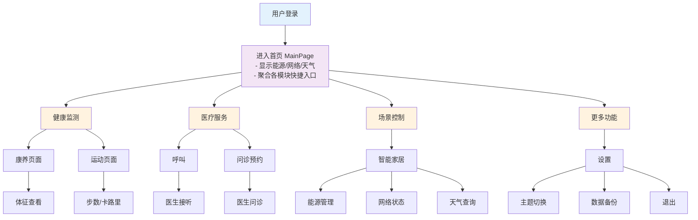

---

## 模块设计

### 5.1 模块依赖关系

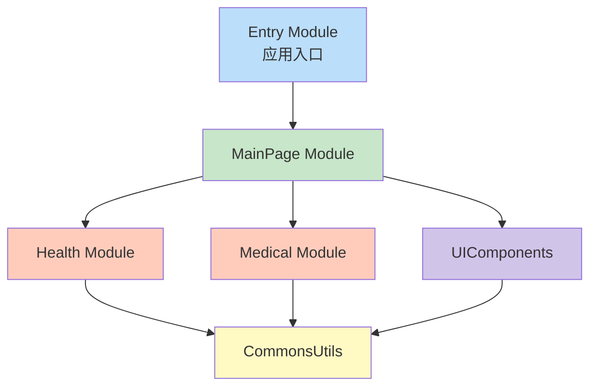

### 5.2 健康监测模块结构

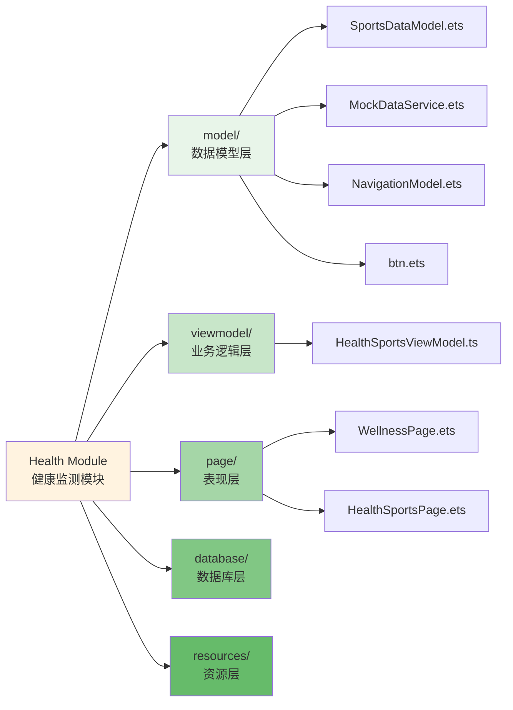

### 5.3 医疗服务模块结构

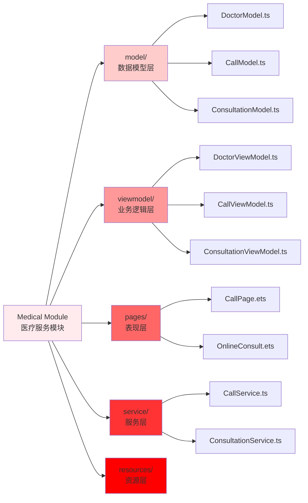

### 5.4 主页模块结构

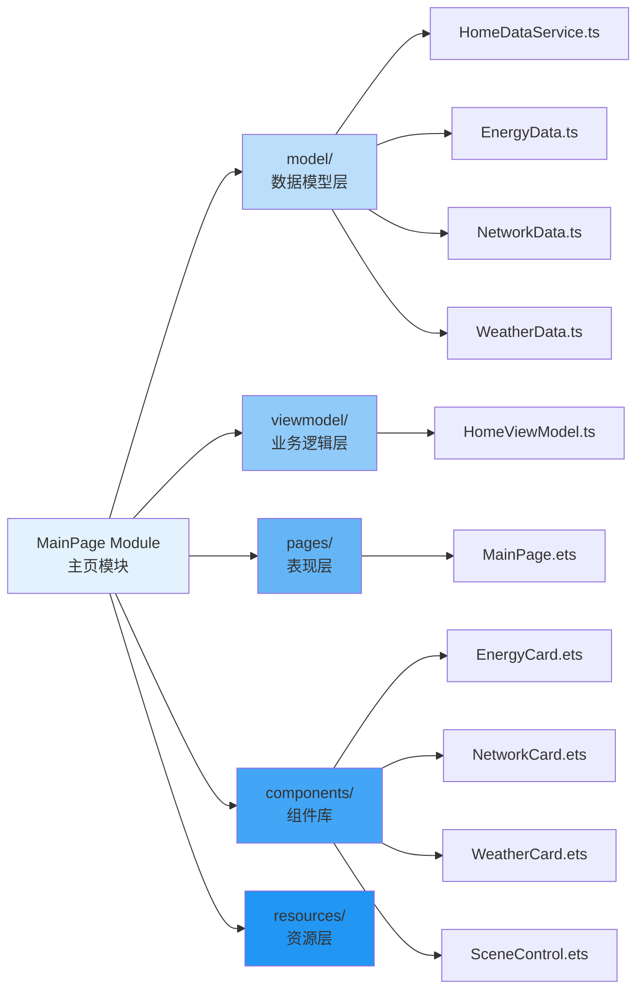

### 5.5 公共能力模块

#### 5.5.1 UIComponents（UI组件库）

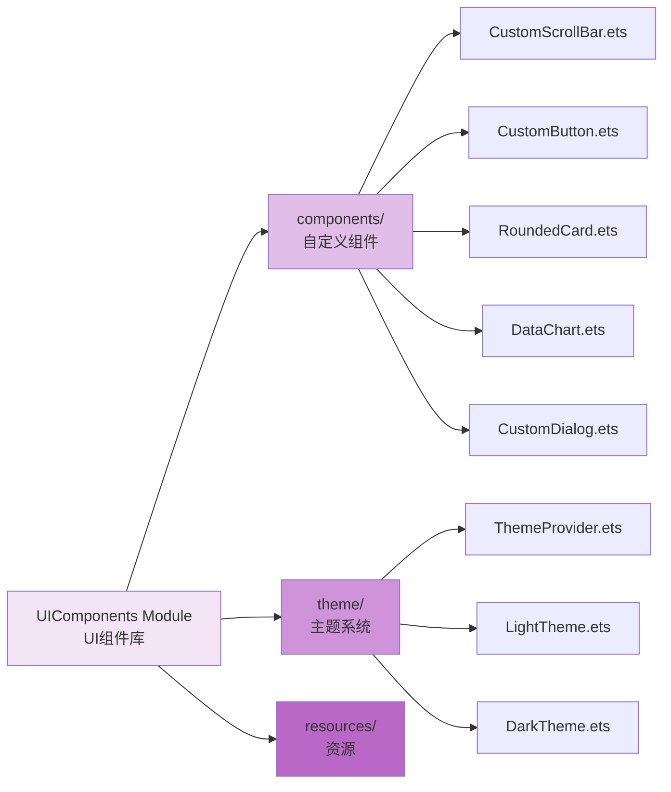

#### 5.5.2 Utils（工具库）

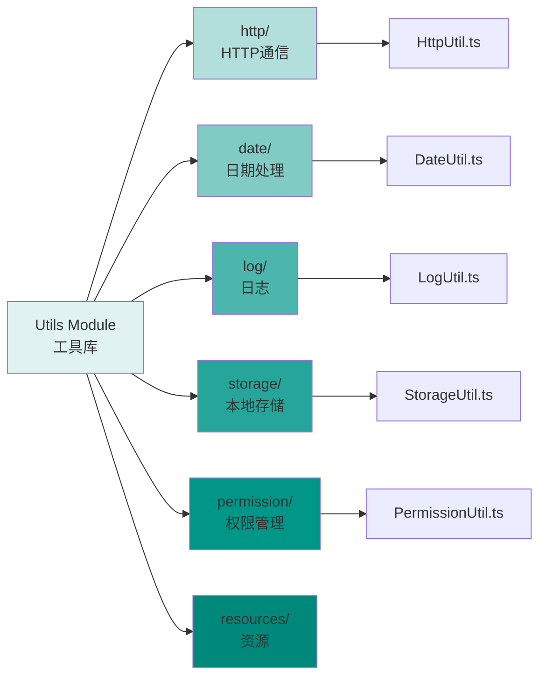

---

## 关键流程设计

### 6.1 应用启动流程

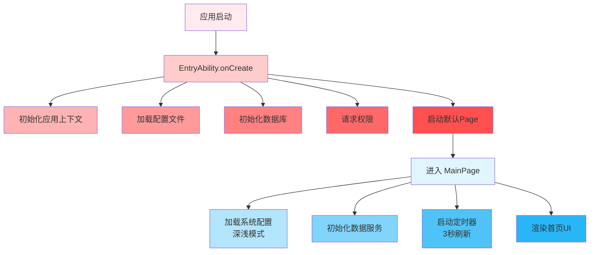

### 6.2 健康数据获取流程（顺序图）

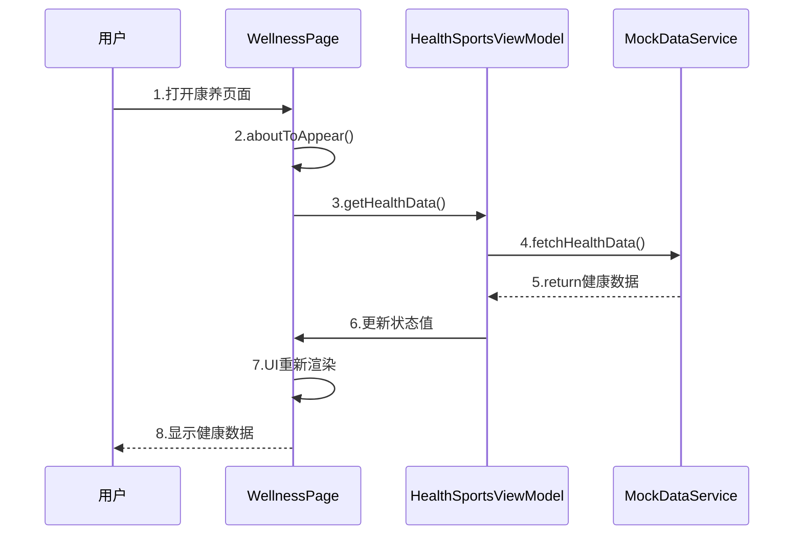

### 6.3 医疗呼叫流程（活动图）

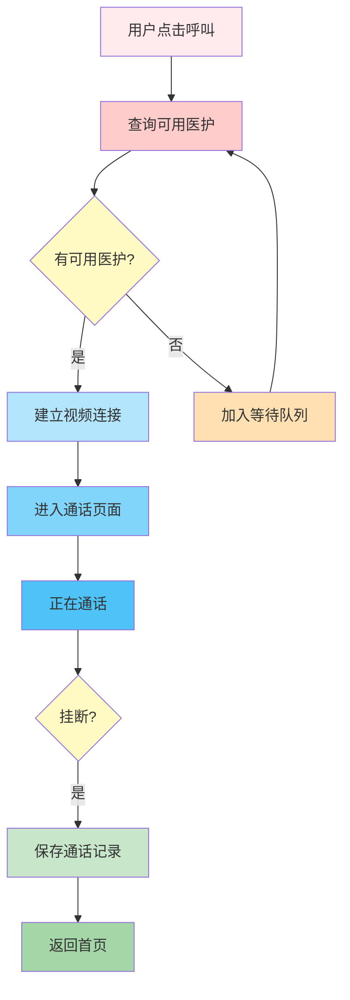

### 6.4 在线问诊流程（顺序图）

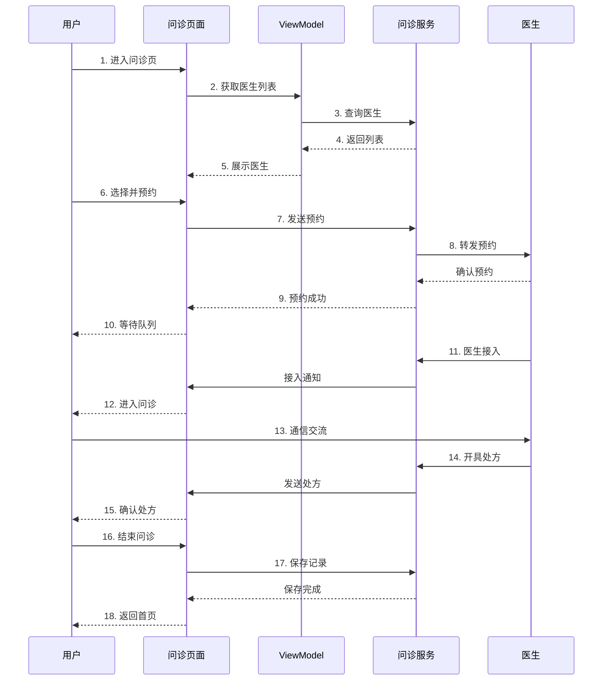

---

## 数据模型设计

### 7.1 核心数据类图

```mermaid
classDiagram
    class HealthData {
        -sleepData: SleepData
        -stressData: StressData
        -heartData: HeartData
        -bpData: BloodPressureData
        -o2Data: BloodOxygenData
        -tempData: TemperatureData
        +getHealthStatus(): string
        +hasAbnormality(): boolean
    }
    
    class SleepData {
        -date: string
        -deepSleep: number
        -lightSleep: number
        -totalSleep: number
    }
    
    class StressData {
        -date: string
        -value: number
        -level: string
    }
    
    class HeartData {
        -date: string
        -heartRate: number
        -status: string
    }
    
    class BloodPressureData {
        -date: string
        -systolic: number
        -diastolic: number
        -status: string
    }
    
    class BloodOxygenData {
        -date: string
        -spo2: number
        -status: string
    }
    
    class TemperatureData {
        -date: string
        -value: number
        -status: string
    }
    
    class SportsData {
        -stepsData: StepsData
        -caloriesData: CaloriesData
        -date: string
        +getProgressRate(): number
        +isGoalReached(): boolean
    }
    
    class StepsData {
        -goal: number
        -current: number
        -distance: number
    }
    
    class CaloriesData {
        -goal: number
        -current: number
        -burned: number
    }
    
    class ConsultationModel {
        -id: string
        -userId: string
        -doctorId: string
        -doctorName: string
        -appointmentTime: string
        -status: string
        -messages: Message[]
        -prescription: Prescription
        +getStatus(): string
        +addMessage(): void
        +setPrescription(): void
    }
    
    class Message {
        -id: string
        -sender: string
        -content: string
        -type: string
        -timestamp: number
    }
    
    class DoctorModel {
        -id: string
        -name: string
        -specialty: string
        -hospital: string
        -rating: number
        -experience: number
        -isAvailable: boolean
        -consultationFee: number
        +getAvailableSlots(): Time[]
        +bookAppointment(): void
    }
    
    class HomeData {
        -energyData: EnergyData
        -networkData: NetworkData
        -weatherData: WeatherData
        +getEnergyStatus(): string
        +getNetworkQuality(): string
        +getWeatherAlert(): Alert
    }
    
    class EnergyData {
        -power: number
        -usage: number
        -carbon: number
        -co2: number
    }
    
    class NetworkData {
        -upload: string
        -download: string
        -quality: string
    }
    
    class WeatherData {
        -temp: number
        -condition: string
        -icon: string
        -alert: string
    }
    
    HealthData *-- SleepData
    HealthData *-- StressData
    HealthData *-- HeartData
    HealthData *-- BloodPressureData
    HealthData *-- BloodOxygenData
    HealthData *-- TemperatureData
    
    SportsData *-- StepsData
    SportsData *-- CaloriesData
    
    ConsultationModel *-- Message
    
    HomeData *-- EnergyData
    HomeData *-- NetworkData
    HomeData *-- WeatherData
```

### 7.2 数据流向

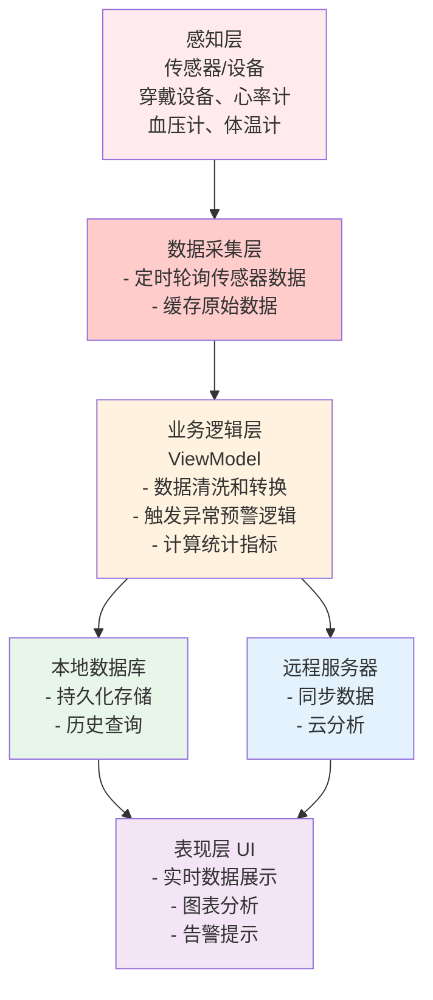

---

## 接口规范

### 8.1 模块间通信接口

#### 8.1.1 主页模块 → 健康模块

```typescript
// 导出健康卡片组件
export struct HealthCard {
  @Prop healthStatus: HealthData;
  onNavigate: (target: string) => void;
}

// 导出健康模块的页面
export { WellnessPage, HealthSportsPage } from './pages';
```

#### 8.1.2 主页模块 → 医疗模块

```typescript
// 导出医疗卡片组件
export struct MedicalCard {
  onCallDoctor: () => void;
  onConsultation: () => void;
}

// 导出医疗模块的页面
export { CallPage, OnlineConsult } from './pages';
```

#### 8.1.3 导航接口（跨模块路由）

```typescript
interface NavigationHelper {
  /**
   * 导航到指定页面
   * @param pageName 页面名称（支持命名路由）
   * @param params 传递参数
   */
  navigateTo(pageName: string, params?: any): void;

  /**
   * 返回上一个页面
   */
  goBack(): void;

  /**
   * 替换当前页面
   */
  replaceWith(pageName: string, params?: any): void;
}
```

### 8.2 数据服务接口

#### 8.2.1 健康数据服务

```typescript
interface IHealthService {
  /**
   * 获取今日健康数据
   */
  getHealthData(): Promise<HealthData>;

  /**
   * 获取运动数据
   */
  getSportsData(): Promise<SportsData>;

  /**
   * 获取历史数据（按日期范围）
   */
  getHistoryData(startDate: string, endDate: string): Promise<HealthData[]>;

  /**
   * 检查异常数据
   */
  checkAbnormality(data: HealthData): AbnormalityAlert[];

  /**
   * 保存健康数据
   */
  saveHealthData(data: HealthData): Promise<boolean>;
}
```

#### 8.2.2 医疗服务接口

```typescript
interface IMedicalService {
  /**
   * 获取可用医生列表
   */
  getAvailableDoctors(): Promise<Doctor[]>;

  /**
   * 发起呼叫
   */
  initiateCall(doctorId: string): Promise<CallSession>;

  /**
   * 结束呼叫
   */
  endCall(callId: string): Promise<boolean>;

  /**
   * 预约问诊
   */
  bookConsultation(doctorId: string, timeSlot: string): Promise<Consultation>;

  /**
   * 获取问诊记录
   */
  getConsultationHistory(): Promise<Consultation[]>;

  /**
   * 保存问诊消息
   */
  saveMessage(consultId: string, message: Message): Promise<boolean>;
}
```

#### 8.2.3 首页数据服务

```typescript
interface IHomeDataService {
  /**
   * 获取能源数据
   */
  getEnergyData(): EnergyData;

  /**
   * 获取网络数据
   */
  getNetworkData(): NetworkData;

  /**
   * 获取天气数据
   */
  getWeatherData(): Promise<WeatherData>;

  /**
   * 聚合所有首页数据
   */
  getAllHomeData(): Promise<HomeData>;
}
```

### 8.3 HTTP API 规范

#### 8.3.1 RESTful 端点

```
【健康相关】
GET    /api/v1/health/today              获取今日健康数据
GET    /api/v1/health/history?from&to    获取历史数据
POST   /api/v1/health/save                保存健康数据
GET    /api/v1/sports/today               获取今日运动数据

【医疗相关】
GET    /api/v1/doctors                    获取医生列表
POST   /api/v1/call/initiate              发起呼叫
POST   /api/v1/call/end/{callId}          结束呼叫
POST   /api/v1/consultation/book          预约问诊
GET    /api/v1/consultation/history       获取问诊历史
POST   /api/v1/consultation/{id}/message  发送问诊消息

【首页相关】
GET    /api/v1/home/energy                获取能源数据
GET    /api/v1/home/weather               获取天气数据
GET    /api/v1/home/network               获取网络状态
```

#### 8.3.2 请求/响应格式

```json
// 请求示例
{
  "method": "GET",
  "url": "https://api.example.com/api/v1/health/today",
  "headers": {
    "Content-Type": "application/json",
    "Authorization": "Bearer {token}"
  }
}

// 成功响应格式
{
  "code": 200,
  "message": "success",
  "data": {
    "heartRate": 72,
    "bloodPressure": {
      "systolic": 120,
      "diastolic": 80
    },
    "bloodOxygen": 98,
    "temperature": 36.5
  },
  "timestamp": 1703891234567
}

// 错误响应格式
{
  "code": 400,
  "message": "参数错误",
  "errors": [
    {
      "field": "userId",
      "reason": "用户不存在"
    }
  ],
  "timestamp": 1703891234567
}
```

---

## 附录：关键类设计

### A.1 ViewModel 基类

```typescript
/**
 * ViewModel 基类，定义通用的业务逻辑处理能力
 */
export abstract class BaseViewModel {
  protected isLoading: boolean = false;
  protected errorMessage: string = '';

  /**
   * 加载数据（需由子类实现）
   */
  abstract loadData(): Promise<void>;

  /**
   * 错误处理
   */
  protected handleError(error: Error): void {
    this.errorMessage = error.message;
    console.error(`错误: ${error}`);
  }

  /**
   * 数据验证
   */
  protected validate(data: any): boolean {
    return data !== null && data !== undefined;
  }
}
```

### A.2 Service 基类

```typescript
/**
 * Service 基类，定义数据访问和业务操作
 */
export abstract class BaseService {
  protected baseUrl: string = 'https://api.example.com';
  protected timeout: number = 30000;

  /**
   * HTTP 请求封装
   */
  protected async request<T>(
    method: string,
    endpoint: string,
    data?: any
  ): Promise<T> {
    try {
      // 调用 HttpUtil 发送请求
      const response = await HttpUtil.request({
        method,
        url: `${this.baseUrl}${endpoint}`,
        data,
        timeout: this.timeout
      });
      return response.data as T;
    } catch (error) {
      this.handleError(error);
      throw error;
    }
  }

  protected handleError(error: any): void {
    console.error(`服务错误: ${error}`);
  }
}
```

### A.3 路由帮助类

```typescript
/**
 * 路由导航帮助类
 */
export class RouterHelper {
  /**
   * 导航到指定页面
   */
  static navigate(
    routeName: string,
    params?: Record<string, any>
  ): void {
    router.pushUrl({
      url: `pages/${routeName}`,
      params: params || {}
    });
  }

  /**
   * 返回上一页
   */
  static back(): void {
    router.back();
  }

  /**
   * 用命名路由导航
   */
  static navigateByName(routeName: string): void {
    router.pushNamedRoute({
      name: routeName
    });
  }
}
```

---

## 总结

本需求文档详细描述了华为中控屏项目的整体设计，包括：

1. **项目概述** - 明确的项目目标和特点
2. **功能需求** - 主要功能模块和具体需求
3. **系统架构** - 分层架构设计，清晰的职责划分
4. **UML设计** - 用例图、流程图、类图等
5. **模块结构** - 各模块的详细划分和组成
6. **数据模型** - 完整的数据结构设计
7. **接口规范** - 模块间通信和API接口定义

通过这份文档，开发团队能够清晰理解项目需求，按照既定的架构进行开发，确保高质量的代码交付。

