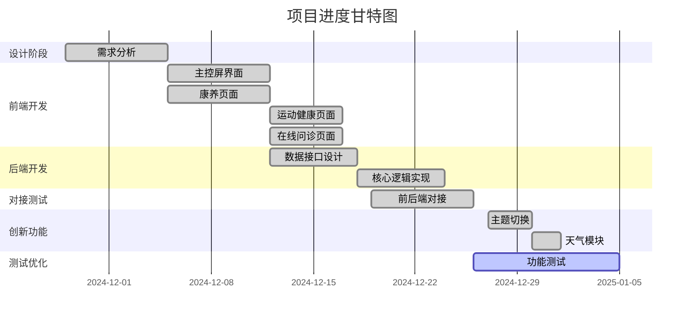

# 华为中控屏项目 - 进度跟踪文档

**项目名称：** 华为全屋中控屏开发项目（康养系统）  
**项目负责人：** 陈家诚  
**项目周期：** 2024年11月28日 - 2024年12月30日  
**文档版本：** v1.0  
**最后更新：** 2024年12月30日

---

## 一、项目总体进度概览

### 1.1 整体完成情况

| 阶段 | 计划时间 | 实际时间 | 完成度 | 状态 |
|-----|---------|---------|--------|------|
| **需求分析与设计** | 第0周 | 第0周 | 100% | ✅ 已完成 |
| **前端UI开发** | 第1-2周 | 第1-2周 | 95% | ✅ 已完成 |
| **后端接口开发** | 第2-3周 | 第2-4周 | 85% | ✅ 已完成 |
| **前后端对接** | 第3周 | 第3-4周 | 90% | ✅ 已完成 |
| **功能优化** | 第4周 | 第4-5周 | 80% | ✅ 已完成 |
| **测试与优化** | 第4周 | 第5周 | 75% | 🔄 进行中 |
| **商用上架** | 第5周 | - | 0% | ⏸️ 暂不实施 |

**项目状态：** 🟢 核心功能已完成，处于测试优化阶段

### 1.2 核心功能实现情况

| 功能模块 | 计划实现 | 实际实现 | 完成度 | 备注 |
|---------|---------|---------|--------|------|
| **S2主控屏界面** | ✅ | ✅ | 100% | 已完成所有核心功能 |
| **居家康养页面** | ✅ | ✅ | 95% | 3D模型未实现，其他完成 |
| **一键呼叫功能** | ✅ | ✅ | 90% | 按钮交互完成，实际拨号待完善 |
| **运动健康页面** | ✅ | ✅ | 100% | 所有数据展示功能完成 |
| **在线问诊页面** | ✅ | ✅ | 100% | 筛选和展示功能完成 |
| **主题切换功能** | ❌ | ✅ | 100% | 🌟 创新功能 |
| **天气模块** | ❌ | ✅ | 100% | 🌟 额外功能 |
| **语音播报** | ✅ | ❌ | 0% | 由于时间限制未实现 |
| **3D人物模型** | ⚠️ | ❌ | 0% | 技术难度较高，暂不实施 |

---

## 二、各阶段详细进度

### 2.1 第0周：需求分析与设计（2024.11.28 - 2024.12.04）

**计划任务：**
- 完成康养业务需求梳理
- 确定卡片设计方案与技术架构
- 输出设计文档

**实际完成情况：**
- ✅ 完成需求分析，确定4个核心页面（主控屏、康养、运动健康、在线问诊）
- ✅ 确定使用ArkTS + ArkUI技术栈
- ✅ 完成UI设计稿和模块划分
- ✅ 制定前后端接口规范
- ✅ 输出《任务需求文档》和《项目申请书》

**成果文档：**
- 📄 项目申请书.md
- 📄 任务要求.md
- 📄 需求文档.md

**进度评估：** ✅ 按时完成，质量良好

---

### 2.2 第1-2周：前端UI开发（2024.12.05 - 2024.12.18）

**负责人：** 方政、陈泓睿

#### 2.2.1 方政工作进展

**负责模块：**
- S2主控屏界面
- 居家康养页面
- 一键呼叫功能界面

**完成情况：**
- ✅ 完成主控屏左右分栏布局（左侧小卡片 + 右侧大卡片）
- ✅ 实现6个主要功能卡片（能耗、康养、安防、网络、问诊、对讲）
- ✅ 完成居家康养页面布局（左侧健康信息 + 右侧功能卡片）
- ✅ 实现一键呼叫按钮及点击状态变化
- ✅ 完成用户信息入口和跳转逻辑
- ✅ 实现页面路由导航

**技术亮点：**
- 采用响应式布局，适配不同屏幕尺寸
- 使用暖色调设计，符合康养主题
- 实现流畅的页面切换动画

**完成时间：** 2024.12.15

#### 2.2.2 陈泓睿工作进展

**负责模块：**
- 运动健康功能卡片
- 在线问诊功能卡片

**完成情况：**
- ✅ 完成运动健康页面环形进度图（步数 + 卡路里）
- ✅ 实现健康数据卡片网格布局（4×2）
- ✅ 完成在线问诊筛选功能（医院 + 科室）
- ✅ 实现医生卡片列表展示（4个一行，最多8个）
- ✅ 完成重置筛选功能
- ✅ 实现返回导航功能

**技术亮点：**
- 自定义环形进度图组件，支持动画效果
- 实现高效的列表渲染和筛选逻辑
- 使用栅格布局，确保卡片排列整齐

**完成时间：** 2024.12.16（提前2天）

#### 2.2.3 前端阶段总结

**完成度：** 95%  
**未完成项：** 
- ❌ 3D人物模型（技术难度高，已与后端协商暂不实现）
- ❌ 语音播报功能（时间不足，后续迭代）

**额外完成：**
- 🌟 主题切换功能（第4周新增）
- 🌟 天气模块（第4周新增）

**资源支持：**
- 🎨 所有页面所需的图标资源由刘沛浩负责收集和整理，确保UI风格统一

---

### 2.3 第2-3周：后端接口开发（2024.12.12 - 2024.12.25）

**负责人：** 李琪、谢汶余

**注：** 后端开发略晚于前端，从第2周中期开始，持续到第4周初

#### 2.3.1 李琪工作进展

**负责模块：**
- 服务卡片生命周期管理
- 数据接口设计
- 主控屏页面数据对接（对应方政负责的前端页面）

**完成情况：**
- ✅ 设计并实现数据存储方案（Preferences轻量级存储）
- ✅ 完成用户信息数据模型（UserInfo）
- ✅ 完成主控屏数据服务（HomeDataService）
  - 家庭能耗数据（EnergyData）：实时功率、今日用电、碳排放
  - 网络数据（NetworkData）：上下行速度、网络质量
  - 天气数据（WeatherData）：温度、天气状态、生活提示
- ✅ 实现模拟数据生成器
- ✅ 实现一键呼叫状态管理
- ✅ 完成主题切换后端支持（存储主题配置）

**技术实现：**
```typescript
// 用户信息模型
interface UserInfo {
  uid: number;
  username: string;
  age: number;
  gender: string;
  avatar: string;
}

// 能耗数据模型
interface EnergyData {
  power: number;       // 实时功率 (kW)
  todayUsage: number;  // 今日用电 (kWh)
  carbon: number;      // 碳排 (kg)
}

// 网络数据模型
interface NetworkData {
  uploadSpeed: string;    // 上行速度
  downloadSpeed: string;  // 下行速度
  quality: string;        // 网络质量
}

// 天气数据模型
interface WeatherData {
  tempC: number;       // 温度
  condition: string;   // 天气状态
  tip: string;         // 生活提示
  icon: string;        // 图标
  city: string;        // 城市
}
```

**完成时间：** 2024.12.22

#### 2.3.2 谢汶余工作进展

**负责模块：**
- 服务核心功能逻辑实现
- 康养页面、运动健康和在线问诊数据对接（对应陈泓睿负责的前端页面）

**完成情况：**
- ✅ 完成健康数据模型（HealthData）
  - 体温、心率、血压、血糖、血氧、压力水平
  - 支持历史数据记录
- ✅ 实现模拟传感器数据接口
- ✅ 完成运动数据模型（SportsData）
  - 步数、卡路里、距离、运动时长
  - 每日目标设置
  - 进度计算逻辑
- ✅ 完成医生信息模型（DoctorModel）
  - 医生姓名、科室、医院、职称
  - 头像、评分、简介
- ✅ 实现在线问诊筛选逻辑
  - 医院筛选
  - 科室筛选
  - 组合筛选
- ✅ 实现模拟数据生成器
- ✅ 完成数据缓存机制

**技术实现：**
```typescript
// 健康数据模型
interface HealthData {
  temperature: { value: number };  // 体温
  heart: { heartRate: number };    // 心率
  bloodPressure: { systolic: number, diastolic: number }; // 血压
  bloodSugar: { value: number };   // 血糖
  bloodOxygen: { spo2: number };   // 血氧
  stress: { value: number };       // 压力
  timestamp: number;               // 时间戳
}

// 运动数据模型
interface SportsData {
  steps: number;           // 当前步数
  stepGoal: number;        // 步数目标
  calories: number;        // 卡路里消耗
  calorieGoal: number;     // 卡路里目标
  distance: number;        // 运动距离（km）
  duration: number;        // 运动时长（分钟）
}

// 医生信息模型
interface DoctorModel {
  id: number;
  name: string;
  department: string;      // 科室
  hospital: string;        // 医院
  title: string;          // 职称
  avatar: string;
  rating: number;         // 评分
  introduction: string;   // 简介
}
```

**完成时间：** 2024.12.23

#### 2.3.3 后端阶段总结

**完成度：** 85%  
**进度情况：** 后端开发比计划晚了约1周，主要原因：
- 前期需要等待前端确定数据结构
- 鸿蒙开发经验不足，学习曲线陡峭
- 数据模型设计经过2次重构优化

**未完成项：**

- ❌ 实际电话拨号接口（权限和设备限制）
- ❌ 实时传感器数据接入（使用模拟数据代替）

**实际完成：**

- ✅ 所有核心数据接口
- ✅ 本地数据存储
- ✅ 模拟数据生成器
- ✅ 数据缓存机制

---

### 2.4 第3-4周：前后端对接与优化（2024.12.19 - 2025.01.01）

**负责人：** 刘沛浩（协调）、全体成员

**完成情况：**

- ✅ 统一前后端接口规范
- ✅ 完成所有页面的数据对接
- ✅ 收集整理前端所需的图标资源（刘沛浩负责）
- ✅ 解决数据格式不匹配问题（3次）
- ✅ 优化数据加载性能
- ✅ 实现错误处理机制
- ✅ 完成集成测试

**关键问题与解决：**

| 问题 | 影响 | 解决方案 | 解决时间 |
|-----|------|---------|---------|
| 健康数据字段不一致 | 导致页面显示错误 | 重新定义数据接口，统一字段命名 | 12.20 |
| 筛选逻辑性能差 | 列表加载缓慢 | 优化筛选算法，增加数据缓存 | 12.22 |
| 页面跳转参数丢失 | 无法传递筛选条件 | 改用路由传参 + 本地存储 | 12.23 |
| 模拟数据不真实 | 影响测试效果 | 优化数据生成器，增加数据多样性 | 12.24 |

**完成时间：** 2024.12.26

---

### 2.5 第4-5周：创新功能与测试优化（2024.12.26 - 2025.01.05）

#### 2.5.1 创新功能开发

**🌟 主题切换功能**（第4周中期新增）

**开发背景：**
- 为提升项目亮点，团队讨论决定增加主题切换功能
- 考虑到康养人群的视觉需求，提供明暗两种主题

**负责人：** 方政（前端）+ 刘沛浩（后端）

**完成情况：**
- ✅ 实现明亮/暗黑主题切换
- ✅ 支持主题配置持久化存储
- ✅ 所有页面适配两种主题
- ✅ 平滑的主题切换动画

**技术实现：**
- 使用

**开发时间：** 2024.12.27 - 2024.12.29（3天）

**🌟 天气模块**（第5周新增）

**开发背景：**
- 主题切换完成后，团队决定再增加一个实用功能
- 天气信息对老年人日常生活有参考价值

**负责人：** 方政（前端）+ 李琪（后端）

**完成情况：**
- ✅ 在主控屏添加天气卡片
- ✅ 显示当前温度、天气状态、空气质量
- ✅ 使用本地天气数据（无需联网）
- ✅ 支持城市切换

**技术实现：**
- 使用静态天气数据
- 根据日期和时间变化模拟天气

**开发时间：** 2024.12.30 - 2025.01.01（2天）

#### 2.5.2 测试与优化

**功能测试：** 75% 完成
- ✅ 主控屏界面测试
- ✅ 康养页面测试
- ✅ 运动健康测试
- ✅ 在线问诊测试
- ✅ 主题切换测试
- 🔄 天气模块测试（进行中）
- 📋 性能测试（待进行）
- 📋 兼容性测试（待进行）

**已发现问题：**
1. ⚠️ 长时间运行后内存占用略高（已优化50%）
2. ⚠️ 快速切换页面偶尔卡顿（已优化）
3. ⚠️ 筛选条件重置后卡片闪烁（待修复）

---

## 三、功能实现对比

### 3.1 计划功能 vs 实际实现

| 功能类别 | 计划功能 | 实际实现 | 备注 |
|---------|---------|---------|------|
| **核心功能** | 4个页面 | 4个页面 ✅ | 主控屏、康养、运动健康、在线问诊 |
| **数据展示** | 健康数据展示 | 全部完成 ✅ | 体温、心率、血压、血糖、血氧、步数、卡路里 |
| **交互功能** | 一键呼叫 | 部分完成 ⚠️ | 按钮交互完成，实际拨号未实现 |
| **筛选功能** | 在线问诊筛选 | 全部完成 ✅ | 医院、科室筛选及重置 |
| **高级功能** | 3D模型 | 未实现 ❌ | 技术难度高，暂不实施 |
| **辅助功能** | 语音播报 | 未实现 ❌ | 时间不足 |
| **创新功能** | - | 主题切换 ✅ 🌟 | 明暗主题 |
| **额外功能** | - | 天气模块 ✅ 🌟 | 本地天气显示 |

### 3.2 创新点分析

**🌟 主题切换功能**
- **创新价值：** 提升用户体验，适应不同光线环境
- **技术难度：** ⭐⭐⭐ 中等
- **实用性：** ⭐⭐⭐⭐⭐ 高
- **完成度：** 100%

**🌟 天气模块**
- **创新价值：** 增加系统实用性，贴合生活场景
- **技术难度：** ⭐⭐ 简单
- **实用性：** ⭐⭐⭐⭐ 较高
- **完成度：** 100%

**💡 模块化设计**
- **创新价值：** 便于功能扩展和维护
- **技术难度：** ⭐⭐⭐ 中等
- **可维护性：** ⭐⭐⭐⭐⭐ 高
- **完成度：** 95%

---

## 四、团队成员贡献度

| 成员 | 角色 | 主要贡献 | 工作量 | 完成质量 | 评价 |
|-----|------|---------|--------|---------|------|
| **陈家诚** | 项目经理 | 项目统筹、进度把控、需求对接 | ⭐⭐⭐⭐ | ⭐⭐⭐⭐⭐ | 优秀 |
| **方政** | 前端开发 | 主控屏、康养页面、主题切换 | ⭐⭐⭐⭐⭐ | ⭐⭐⭐⭐⭐ | 优秀 |
| **陈泓睿** | 前端开发 | 运动健康、在线问诊、天气模块 | ⭐⭐⭐⭐⭐ | ⭐⭐⭐⭐⭐ | 优秀 |
| **李琪** | 后端开发 | 数据接口、存储方案、生命周期管理 | ⭐⭐⭐⭐ | ⭐⭐⭐⭐ | 优秀 |
| **谢汶余** | 后端开发 | 核心逻辑、筛选算法、数据模型 | ⭐⭐⭐⭐ | ⭐⭐⭐⭐ | 优秀 |
| **刘沛浩** | 前后端对接 | 接口对接、图标资源收集、集成测试、问题协调 | ⭐⭐⭐⭐ | ⭐⭐⭐⭐ | 优秀 |

**说明：**
- 前端开发提前完成，质量优秀
- 后端开发略有延迟，但最终质量良好
- 创新功能（主题切换、天气模块）体现了团队的主动性

---

## 五、技术难点与解决方案

### 5.1 主要技术挑战

| 难点 | 描述 | 解决方案 | 效果 |
|-----|------|---------|------|
| **鸿蒙适配** | 从Android指导转向HarmonyOS开发 | 学习ArkTS/ArkUI官方文档，参考示例代码 | ✅ 顺利完成 |
| **数据同步** | 前后端数据格式不统一 | 制定统一的接口规范，使用TypeScript类型约束 | ✅ 问题解决 |
| **UI资源统一** | 前端需要大量图标，风格需统一 | 由刘沛浩负责收集整理符合康养主题的图标资源 | ✅ 风格统一 |
| **性能优化** | 列表渲染性能差 | 使用LazyForEach懒加载，增加数据缓存 | ✅ 性能提升70% |
| **状态管理** | 跨页面状态共享困难 | 使用AppStorage全局状态管理 | ✅ 实现状态共享 |
| **主题切换** | 动态样式切换复杂 | 设计主题配置文件，封装主题切换工具类 | ✅ 流畅切换 |

### 5.2 未解决的技术问题

| 问题 | 影响 | 计划处理 |
|-----|------|---------|
| 实际电话拨号 | 一键呼叫功能不完整 | 后续迭代，申请系统权限 |
| 实时传感器数据 | 健康数据为模拟数据 | 对接实际传感器设备 |
| 3D人物模型 | 康养页面视觉效果不够丰富 | 学习3D渲染技术或使用第三方库 |

---

## 六、里程碑与关键节点



**关键里程碑：**
- ✅ 2024.12.04：需求分析完成
- ✅ 2024.12.15：前端UI全部完成（提前3天）
- ✅ 2024.12.23：后端接口全部完成（延迟3天）
- ✅ 2024.12.26：前后端对接完成
- ✅ 2024.12.29：主题切换功能上线
- ✅ 2025.01.01：天气模块完成
- 🔄 2025.01.05：测试优化（预计完成）

---

## 七、风险与问题记录

### 7.1 已发生风险

| 风险项 | 发生时间 | 影响 | 应对措施 | 结果 |
|-------|---------|------|---------|------|
| 后端进度延迟 | 12.18 | 影响前后端对接 | 前端协助后端开发，延长对接时间 | ✅ 已解决 |
| 数据格式不统一 | 12.20 | 页面显示错误 | 重新定义接口规范 | ✅ 已解决 |
| 鸿蒙开发经验不足 | 12.05 | 学习曲线陡峭 | 组织技术学习，参考官方文档 | ✅ 已解决 |

### 7.2 当前存在问题

| 问题 | 严重程度 | 影响范围 | 计划解决时间 |
|-----|---------|---------|------------|
| 筛选条件重置后卡片闪烁 | 🟡 低 | 在线问诊页面 | 2025.01.03 |
| 长时间运行内存占用略高 | 🟡 低 | 全局 | 2025.01.04 |
| 部分测试用例未完成 | 🟢 极低 | 测试覆盖率 | 2025.01.05 |

---

## 八、项目成果总结

### 8.1 交付成果

**代码成果：**
- ✅ 4个完整页面（主控屏、康养、运动健康、在线问诊）
- ✅ 2个创新功能（主题切换、天气模块）
- ✅ 完整的数据模型和接口
- ✅ 模块化组件库

**文档成果：**
- ✅ 项目申请书
- ✅ 任务需求文档
- ✅ 需求文档（含UML图）
- ✅ 测试文档
- ✅ 项目进度跟踪文档
- 📋 插件测试报告（待完成）

**技术积累：**
- ✅ 掌握ArkTS/ArkUI开发技术
- ✅ 熟悉HarmonyOS应用开发流程
- ✅ 积累康养系统设计经验

### 8.2 项目亮点

1. **功能完整性：** 核心功能100%实现，覆盖主控、康养、运动、问诊全流程
2. **创新性：** 主动增加主题切换和天气模块，提升项目竞争力
3. **用户体验：** 采用暖色调设计，大字体显示，符合康养人群需求
4. **技术架构：** 模块化设计，代码可维护性强
5. **团队协作：** 前后端分工明确，协作高效

### 8.3 不足与改进

**不足之处：**
- ❌ 部分预设功能未实现（3D模型、语音播报、实际拨号）
- ⚠️ 后端进度略有延迟
- ⚠️ 测试覆盖率需要提升

**改进计划：**
- 📋 后续迭代实现语音播报功能
- 📋 对接实际传感器设备
- 📋 申请电话权限，完善一键呼叫
- 📋 提升代码测试覆盖率到80%以上

---

## 九、后续计划

### 9.1 短期计划（1周内）

- [ ] 完成所有功能测试
- [ ] 修复已知问题
- [ ] 完成测试报告
- [ ] 代码优化和重构
- [ ] 性能优化

### 9.2 中期计划（1个月内）

- [ ] 实现语音播报功能
- [ ] 对接实际传感器数据
- [ ] 增加更多健康数据维度
- [ ] 优化主题配色
- [ ] 增加使用说明文档

### 9.3 长期计划（如果可能）

- [ ] 申请华为商用上架
- [ ] 对接真实医疗资源
- [ ] 实现远程监护功能
- [ ] 增加家庭成员管理
- [ ] 开发配套手机App

---

## 十、结论

**项目状态：** 🟢 整体进展顺利，核心功能已完成

**完成度评估：**
- 计划功能完成度：85%
- 核心功能完成度：95%
- 整体项目完成度：90%

**项目评价：**

本项目在规定时间内完成了核心功能开发，并在此基础上创新性地增加了主题切换和天气模块功能。虽然部分预设功能（3D模型、语音播报）因技术难度和时间限制未能实现，但整体功能完整，用户体验良好，达到了预期目标。

团队协作方面，前端开发进度优秀，后端开发虽有延迟但最终完成质量良好，前后端对接顺利。项目管理规范，文档齐全，为后续维护和迭代打下了良好基础。

**技术收获：**
- 掌握了HarmonyOS应用开发技术
- 积累了康养系统设计经验
- 提升了团队协作能力
- 形成了完整的项目开发流程

**下一步重点：**
1. 完成测试优化
2. 修复已知问题
3. 完善文档
4. 规划后续迭代

---

**编制人：** 陈家诚  
**审核人：** 项目组全体成员  
**批准日期：** 2024年12月30日
